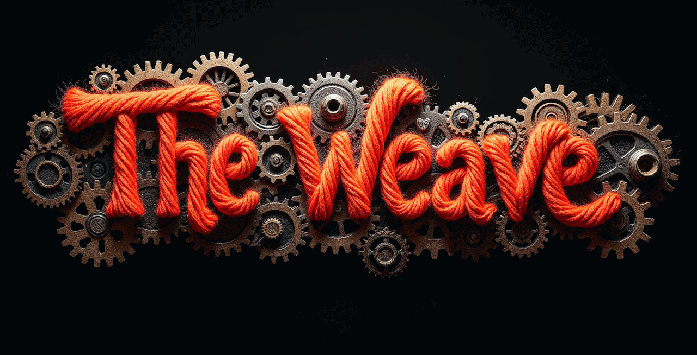
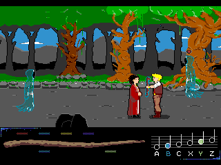
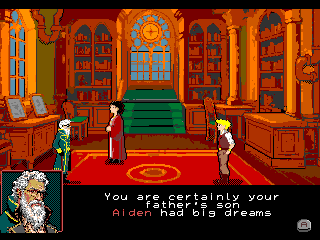
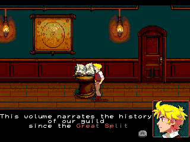

# The Weave

> A fangame sequel to LucasArts' *Loom* for the Sega Mega Drive / Genesis.

**The Weave** is a new retro game currently in development. Set a century after the classic adventure *Loom*, it aims for an interesting story, well‑written characters and a weekend-length adventure that does not require lightning reflexes.

The engine is being created from scratch in C using [SGDK](https://github.com/Stephane-D/SGDK) and the graphics are being replaced with hand crafted pixel art.

## Features

- Cinematic cutscenes with dialogues in English and Spanish.
- Puzzle solving with magic spells and interactable objects.
- Many magic patterns with musical notes you will unlock during the adventure.
- Numerous new characters, guilds and locations.
- Spells combat with various enemies.
- Game engine from scratch using SGDK.
- **Tech demo now available!**

## Development status

A first playable version of Act One (with both English and Spanish text) is hopefully expected by the end of 2025. The game will be **free** and the **source code** will be available on GitHub.

### Wanted: graphic artists!

WANTED: Graphic artists who can handle Sega Megadrive hardware limitations.

## Acknowledgements

The Weave stands on the shoulders of many wonderful projects and creators. Thank you all!

### Original inspiration

- **[Loom](https://en.wikipedia.org/wiki/Loom_(video_game))** by **LucasArts**, designed by **Brian Moriarty** — the masterpiece this fangame is a loving tribute to. *The Weave* is a free, non-commercial fan project, not affiliated with or endorsed by LucasArts, Lucasfilm Games or Disney.
- The character voices are inspired by the iconic *Animalese* gibberish from Nintendo's **Animal Crossing** series.

### Engine and development tools

- **[SGDK](https://github.com/Stephane-D/SGDK)** by **Stéphane Dallongeville** — the Sega Mega Drive Development Kit the whole engine is built on, including its `rescomp` resource compiler and the XGM2 sound driver. This game would simply not exist without it.
- **[SGDK official Docker image](https://github.com/Stephane-D/SGDK)** (`ghcr.io/stephane-d/sgdk`) — used to build the ROM reproducibly.
- **[BlastEm](https://www.retrodev.com/blastem/)** by **Michael Pavone** — the highly accurate Mega Drive emulator used for day-to-day testing and debugging.
- **[Aseprite](https://www.aseprite.org/)** — all the pixel art is drawn and animated with it.
- **[Visual Studio Code](https://code.visualstudio.com/)** — development environment.
- **[Python 3](https://www.python.org/)** — all the data-generation and audio tooling scripts.

### Character voices ("gibberish") pipeline

- **[animalese.js](https://github.com/Acedio/animalese.js)** by **Acedio** — the original `animalese.wav` phoneme library our voice generator downloads and processes to synthesize the in-game character voices.
- **[librosa](https://librosa.org/)** — audio analysis and pitch-shifting for the voice profiles.
- **[NumPy](https://numpy.org/)** and **[SciPy](https://scipy.org/)** — signal processing backbone.
- **[SoundFile](https://github.com/bastibe/python-soundfile)** — audio file reading/writing.
- **[pydub](https://github.com/jiaaro/pydub)** and **[gTTS](https://github.com/pndurette/gTTS)** — used by earlier iterations of the voice generator.

### Sound effects

- Magic sound effect by **[hjohnl](https://freesound.org/people/hjohnl/sounds/61521/)** on **Freesound**.
- Typewriter sound effect from **[Pixabay](https://pixabay.com/sound-effects/typewriter-typing-68696/)**.

If you believe you should be credited here and are not, please open an issue — it will be an honest mistake and we will be happy to fix it.

## Follow the project

- [Twitter/X @GeeseBumpsGames](https://x.com/GeeseBumpsGames)
- [Bluesky](https://bsky.app/profile/geesebumpsgames.bsky.social)
- [Website](http://www.geesebumps.com)
- [Itch.io page](https://geese-bumps.itch.io/the-weave)

## Screenshots

In-game screenshots from June'25 tech demo

