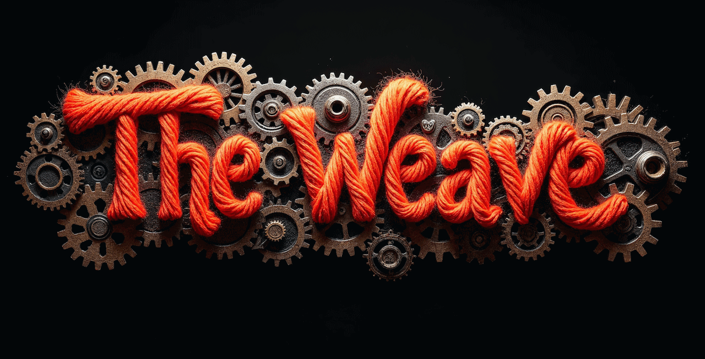

# The Weave

> A fangame sequel to LucasArts' *Loom* for the Sega Mega Drive / Genesis.

**The Weave** is a new retro game currently in development. Set a century after the classic adventure *Loom*, it aims for an interesting story, well‑written characters and a weekend-length adventure that does not require lightning reflexes.

The engine is being created from scratch in C using [SGDK](https://github.com/Stephane-D/SGDK) and the graphics are being replaced with hand crafted pixel art.

## Features

- Cinematic cutscenes with dialogues in English and Spanish.
- Puzzle solving with magic spells and interactable objects.
- Many magic patterns with musical notes you will unlock during the adventure.
- Numerous new characters, guilds and locations.
- Spells combat with various enemies.
- Game engine from scratch using SGDK.
- **Tech demo now available!**

## Development status

A first playable version of Act One (with both English and Spanish text) is hopefully expected by the end of 2025. The game will be **free** and the **source code** will be available on GitHub.

### Wanted: graphic artists!

WANTED: Graphic artists who can handle Sega Megadrive hardware limitations.

## Follow the project

- [Twitter/X @GeeseBumpsGames](https://x.com/GeeseBumpsGames)
- [Bluesky](https://bsky.app/profile/geesebumpsgames.bsky.social)
- [Website](http://www.geesebumps.com)
- [Itch.io page](https://geese-bumps.itch.io/the-weave)

## Screenshots

In-game screenshots from June'25 tech demo

