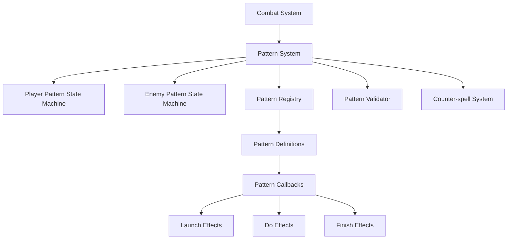

# Combat Pattern System Refactoring Plan

## Current Issues

1. **Code Duplication**: Similar logic is repeated across character_patterns.c and enemies_patterns.c
2. **Complex State Management**: Too many global variables tracking state across different files
3. **Inconsistent State Machine Usage**: State machine implementation exists but isn't fully utilized
4. **Counter-spell Mechanism**: Same code appears in multiple places
5. **Organic Growth**: System has grown without proper architecture, making it hard to add new patterns or fix bugs

## Refactoring Goals

1. **Complete State Machine Transition**: Fully leverage the state machine approach
2. **Unified Pattern System**: Create a generic pattern system for both player and enemies
3. **Eliminate Duplication**: Consolidate redundant code
4. **Simplify State Management**: Reduce global state variables
5. **Improve Maintainability**: Make it easier to add new patterns and fix bugs
6. **Incremental Approach**: Minimize disruption to existing functionality

## High-Level Architecture



## Detailed Implementation Plan

### Phase 1: Consolidate Pattern Definitions

1. **Create a Unified Pattern Structure**:
   - Enhance the existing `Pattern` struct to include all necessary fields for both player and enemy patterns
   - Add fields for pattern type, owner type (player/enemy), and callback functions

2. **Create a Pattern Registry**:
   - Implement a central registry for all patterns (both player and enemy)
   - Provide functions to register, retrieve, and validate patterns

### Phase 2: Refactor State Machine Integration

1. **Enhance StateMachine Structure**:
   - Update to better handle pattern-specific state
   - Add fields for pattern ownership and validation

2. **Implement Unified State Handling**:
   - Create common state transition functions
   - Standardize message handling for pattern events

### Phase 3: Implement Counter-spell System

1. **Create a Dedicated Counter-spell Module**:
   - Centralize all counter-spell logic
   - Provide clear interfaces for checking and executing counter-spells

2. **Update Combat System to Use Counter-spell Module**:
   - Modify combat.c to use the new counter-spell system
   - Ensure proper interaction between player and enemy state machines

### Phase 4: Refactor Pattern-Specific Code

1. **Implement Pattern-Specific Callbacks**:
   - Create separate files for each pattern type (electric.c, hide.c, etc.)
   - Implement standard callback interfaces for each pattern

2. **Register Patterns with the Registry**:
   - Initialize all patterns with their callbacks
   - Register them with the pattern registry

### Phase 5: Update Main Game Loop Integration

1. **Simplify Main Loop Pattern Handling**:
   - Update check_active_character_state() to use the state machine exclusively
   - Update check_enemy_state() to use the state machine exclusively

2. **Clean Up Global State Variables**:
   - Gradually move global state into the appropriate state machines
   - Provide accessor functions where needed for compatibility

## Implementation Sequence

To ensure minimal disruption, I recommend implementing the refactoring in this order:

1. Create the pattern registry and enhanced pattern structure
2. Implement the counter-spell system
3. Refactor one pattern at a time (starting with electric)
4. Update the state machine integration
5. Clean up global state variables
6. Update the main game loop integration

## File Changes Required

### New Files to Create

1. **patterns_registry.h/c**: Central pattern registry
2. **counter_spell.h/c**: Counter-spell system
3. **pattern_types/electric_pattern.h/c**: Electric pattern implementation
4. **pattern_types/hide_pattern.h/c**: Hide pattern implementation
5. **pattern_types/sleep_pattern.h/c**: Sleep pattern implementation
6. **pattern_types/open_pattern.h/c**: Open pattern implementation
7. **pattern_types/bite_pattern.h/c**: Bite pattern implementation

### Files to Modify

1. **patterns.h**: Update Pattern struct definition
2. **statemachine.h/c**: Enhance state machine to better handle patterns
3. **character_patterns.h/c**: Refactor to use the new pattern system
4. **enemies_patterns.h/c**: Refactor to use the new pattern system
5. **combat.h/c**: Update to use the counter-spell system
6. **globals.h**: Add new includes and update forward declarations

## Detailed Implementation

### 1. Enhanced Pattern Structure (patterns.h)

```c
// Pattern structure for spell patterns
typedef struct Pattern {
    u16 id;                     // Pattern identifier
    bool active;                // Whether pattern is available
    u8 notes[4];                // Sequence of notes for this pattern
    u16 owner_type;             // OWNER_PLAYER or OWNER_ENEMY
    u16 recharge_time;          // Time before pattern can be used again (for enemies)
    bool (*can_use)(void);      // Function to check if pattern can be used
    void (*launch)(StateMachine*);    // Function to launch pattern effect
    void (*do_effect)(StateMachine*); // Function to process ongoing effect
    void (*finish)(StateMachine*);    // Function to finish effect
    Sprite *sd;                 // Sprite data for pattern visualization
} Pattern;
```

### 2. Pattern Registry (patterns_registry.h/c)

```c
// patterns_registry.h
#ifndef PATTERNS_REGISTRY_H
#define PATTERNS_REGISTRY_H

#include "globals.h"

#define MAX_REGISTERED_PATTERNS 10
#define OWNER_PLAYER 0
#define OWNER_ENEMY 1

// Pattern registry functions
void pattern_registry_init(void);
void register_pattern(Pattern* pattern);
Pattern* get_pattern(u16 pattern_id, u16 owner_type);
u8 validate_pattern_sequence(u8* notes, bool* is_reverse, u16 owner_type);

#endif
```

```c
// patterns_registry.c
#include "patterns_registry.h"

// Registry storage
static Pattern registered_patterns[MAX_REGISTERED_PATTERNS];
static u16 pattern_count = 0;

void pattern_registry_init(void) {
    pattern_count = 0;
    // Initialize with empty patterns
    for (u16 i = 0; i < MAX_REGISTERED_PATTERNS; i++) {
        registered_patterns[i].id = PTRN_NONE;
        registered_patterns[i].active = false;
    }
}

void register_pattern(Pattern* pattern) {
    if (pattern_count < MAX_REGISTERED_PATTERNS) {
        registered_patterns[pattern_count] = *pattern;
        pattern_count++;
    }
}

Pattern* get_pattern(u16 pattern_id, u16 owner_type) {
    for (u16 i = 0; i < pattern_count; i++) {
        if (registered_patterns[i].id == pattern_id && 
            registered_patterns[i].owner_type == owner_type) {
            return &registered_patterns[i];
        }
    }
    return NULL;
}

u8 validate_pattern_sequence(u8* notes, bool* is_reverse, u16 owner_type) {
    u8 matches, reverse_matches;
    
    for (u16 i = 0; i < pattern_count; i++) {
        if (registered_patterns[i].owner_type != owner_type) {
            continue;
        }
        
        matches = 0;
        reverse_matches = 0;
        
        // Check forward match
        for (u8 j = 0; j < 4; j++) {
            if (notes[j] == registered_patterns[i].notes[j]) {
                matches++;
            }
            if (notes[j] == registered_patterns[i].notes[3-j]) {
                reverse_matches++;
            }
        }
        
        // Pattern found if all notes match and pattern is active
        if (matches == 4 && registered_patterns[i].active) {
            *is_reverse = false;
            return registered_patterns[i].id;
        }
        else if (reverse_matches == 4 && registered_patterns[i].active) {
            *is_reverse = true;
            return registered_patterns[i].id;
        }
    }
    
    return PTRN_NONE;
}
```

### 3. Counter-spell System (counter_spell.h/c)

```c
// counter_spell.h
#ifndef COUNTER_SPELL_H
#define COUNTER_SPELL_H

#include "globals.h"

// Counter-spell system functions
bool can_counter_spell(u16 player_pattern, u16 enemy_pattern, bool is_reverse);
void execute_counter_spell(StateMachine* player_sm, StateMachine* enemy_sm, u16 pattern_id);
void handle_counter_spell_result(bool success, u16 enemy_id, u16 pattern_id);

// Global flag for counter-spell success
extern bool counter_spell_success;

#endif
```

```c
// counter_spell.c
#include "counter_spell.h"

// Global flag for counter-spell success
bool counter_spell_success = false;

bool can_counter_spell(u16 player_pattern, u16 enemy_pattern, bool is_reverse) {
    // Currently only electric pattern can counter electric enemy pattern when reversed
    if (player_pattern == PTRN_ELECTRIC && 
        enemy_pattern == PTRN_EN_ELECTIC && 
        is_reverse) {
        return true;
    }
    return false;
}

void execute_counter_spell(StateMachine* player_sm, StateMachine* enemy_sm, u16 pattern_id) {
    // Set counter-spell success flag
    counter_spell_success = true;
    
    // Update player state machine
    player_sm->current_state = SM_STATE_PATTERN_EFFECT;
    player_sm->active_pattern = pattern_id;
    player_sm->is_reversed = true;
    player_sm->pattern_system.effect_reversed = true;
    
    // Configure callbacks
    Pattern* pattern = get_pattern(pattern_id, OWNER_PLAYER);
    if (pattern) {
        player_sm->launch_effect = pattern->launch;
        player_sm->do_effect = pattern->do_effect;
        player_sm->finish_effect = pattern->finish;
        
        // Launch the effect
        if (player_sm->launch_effect) {
            player_sm->launch_effect(player_sm);
        }
    }
    
    // Hit the enemy
    hit_enemy(enemy_sm->entity_id - ENEMY_ENTITY_ID_BASE);
    
    // Reset enemy attack state
    enemy_sm->current_state = SM_STATE_IDLE;
    enemy_sm->pattern_system.effect_in_progress = false;
    
    // Visual cleanup
    VDP_setHilightShadow(false);
}

void handle_counter_spell_result(bool success, u16 enemy_id, u16 pattern_id) {
    if (success) {
        // Show success message
        show_or_hide_interface(false);
        show_or_hide_enemy_combat_interface(false);
        talk_dialog(&dialogs[ACT1_DIALOG3][3]); // "Counter-attack!"
        show_or_hide_enemy_combat_interface(true);
        show_or_hide_interface(true);
    } else {
        // Reset counter-spell flag
        counter_spell_success = false;
    }
}
```

### 4. Enhanced State Machine (statemachine.h)

```c
// Add to statemachine.h
typedef struct StateMachine {
    // Existing fields...
    
    // Enhanced pattern system
    u16 owner_type;                // OWNER_PLAYER or OWNER_ENEMY
    u16 entity_id;                 // ID of the entity (player or enemy)
    u16 active_pattern;            // Currently active pattern ID
    bool is_reversed;              // Whether current pattern is reversed
    bool is_counter_spell;         // Whether current pattern is a counter-spell
    
    // Pattern system
    PatternSystem pattern_system;
    
    // Pattern callbacks
    EffectCallback launch_effect;  // Function to launch effect
    EffectCallback do_effect;      // Function to process effect
    EffectCallback finish_effect;  // Function to finish effect
} StateMachine;

// Add new functions
void StateMachine_HandlePatternComplete(StateMachine* sm, u16 pattern_id, bool is_reverse);
void StateMachine_HandleNoteInput(StateMachine* sm, u8 note);
void StateMachine_HandlePatternTimeout(StateMachine* sm);
```

### 5. Pattern-Specific Implementation (electric_pattern.h/c)

```c
// electric_pattern.h
#ifndef ELECTRIC_PATTERN_H
#define ELECTRIC_PATTERN_H

#include "globals.h"

// Electric pattern functions
bool electric_pattern_can_use(void);
void electric_pattern_launch(StateMachine* sm);
void electric_pattern_do(StateMachine* sm);
void electric_pattern_finish(StateMachine* sm);

#endif
```

```c
// electric_pattern.c
#include "electric_pattern.h"
#include "counter_spell.h"

bool electric_pattern_can_use(void) {
    // Check if we're in combat with an enemy using electric attack
    if (is_combat_active && enemy_attacking != ENEMY_NONE &&
        enemy_attack_effect_in_progress && enemy_attack_pattern == PTRN_EN_ELECTIC) {
        return true;
    }
    
    // Check if player is hidden
    if (player_pattern_effect_in_progress == PTRN_HIDE) {
        // Can't use thunder while hidden
        show_or_hide_interface(false);
        show_or_hide_enemy_combat_interface(false);
        talk_dialog(&dialogs[ACT1_DIALOG3][9]); // "I can't launch spells while hiding"
        show_or_hide_enemy_combat_interface(true);
        show_or_hide_interface(true);
        return false;
    }
    
    return true;
}

void electric_pattern_launch(StateMachine* sm) {
    // Visual and sound effects
    anim_character(sm->entity_id, ANIM_MAGIC);
    show_pattern_icon(PTRN_ELECTRIC, true, true);
    play_pattern_sound(PTRN_ELECTRIC);
    
    // Update state machine
    sm->pattern_system.effect_type = PTRN_ELECTRIC;
    sm->pattern_system.effect_in_progress = true;
    sm->pattern_system.effect_duration = 0;
    
    // For compatibility with existing code
    player_pattern_effect_in_progress = PTRN_ELECTRIC;
    player_pattern_effect_time = 0;
    player_pattern_effect_reversed = sm->is_reversed;
}

void electric_pattern_do(StateMachine* sm) {
    // If a counter-spell has succeeded, don't do anything
    if (counter_spell_success && sm->is_counter_spell) {
        // Reset state machine
        sm->current_state = SM_STATE_IDLE;
        sm->timer = 0;
        sm->effect_time = 0;
        sm->pattern_system.effect_in_progress = false;
        sm->pattern_system.effect_type = PTRN_NONE;
        sm->pattern_system.effect_duration = 0;
        
        // Reset visual effects
        VDP_setHilightShadow(false);
        
        return;
    }
    
    // Visual thunder effect
    VDP_setHilightShadow((sm->pattern_system.effect_duration % 2) == 0);
    SPR_update();
    SYS_doVBlankProcess();
    
    // Apply combat effects
    if (is_combat_active && sm->pattern_system.effect_duration == 10) {
        for (u16 nenemy = 0; nenemy < MAX_ENEMIES; nenemy++) {
            if (obj_enemy[nenemy].obj_character.active &&
                obj_enemy[nenemy].class_id == ENEMY_CLS_3HEADMONKEY &&
                obj_enemy[nenemy].hitpoints > 0) {
                hit_enemy(nenemy);
            }
        }
    }
    
    // Update duration
    sm->pattern_system.effect_duration++;
    
    // For compatibility with existing code
    player_pattern_effect_time++;
    
    // Check if effect is complete
    if (sm->pattern_system.effect_duration >= 20) {
        // Ensure visual effect is disabled
        VDP_setHilightShadow(false);
        show_pattern_icon(PTRN_ELECTRIC, false, false);
        SPR_update();
        sm->current_state = SM_STATE_PATTERN_EFFECT_FINISH;
    }
}

void electric_pattern_finish(StateMachine* sm) {
    // Ensure visual effect is disabled
    VDP_setHilightShadow(false);
    show_pattern_icon(PTRN_ELECTRIC, false, false);
    SPR_update();
    
    // Reset state
    sm->pattern_system.effect_type = PTRN_NONE;
    sm->pattern_system.effect_in_progress = false;
    sm->pattern_system.effect_duration = 0;
    sm->is_counter_spell = false;
    
    // For compatibility with existing code
    player_pattern_effect_in_progress = PTRN_NONE;
    player_pattern_effect_time = 0;
    player_pattern_effect_reversed = false;
}
```

### 6. Updated Character Patterns (character_patterns.c)

The character_patterns.c file would be significantly refactored to use the new pattern system. Here's a sketch of the key changes:

```c
// In init_patterns()
void init_patterns(void) {
    // Initialize pattern registry
    pattern_registry_init();
    
    // Register player patterns
    Pattern electric_pattern = {
        .id = PTRN_ELECTRIC,
        .active = true,
        .notes = {1, 2, 3, 4},
        .owner_type = OWNER_PLAYER,
        .can_use = electric_pattern_can_use,
        .launch = electric_pattern_launch,
        .do_effect = electric_pattern_do,
        .finish = electric_pattern_finish
    };
    register_pattern(&electric_pattern);
    
    // Register other patterns...
    
    // Initialize state machine
    StateMachine_Init(&player_state_machine, active_character);
    player_state_machine.owner_type = OWNER_PLAYER;
    
    // Configure pattern system
    player_state_machine.pattern_system.enabled = true;
}

// In check_active_character_state()
void check_active_character_state(void) {
    // Update state machine
    StateMachine_Update(&player_state_machine, NULL);
    
    // Update character state from state machine
    if (obj_character[active_character].state != STATE_WALKING) {
        update_character_from_sm_state(&obj_character[active_character],
                                    player_state_machine.current_state);
    }
    
    // Handle counter-spell detection
    if (is_combat_active && enemy_attacking != ENEMY_NONE && 
        enemy_attack_effect_in_progress && num_played_notes == 4) {
        
        bool is_reverse_match = false;
        u8 matched_pattern = validate_pattern_sequence(played_notes, &is_reverse_match, OWNER_PLAYER);
        
        if (matched_pattern == PTRN_ELECTRIC && is_reverse_match &&
            enemy_attack_pattern == PTRN_EN_ELECTIC) {
            
            // Execute counter-spell
            execute_counter_spell(&player_state_machine, 
                                &enemy_state_machines[enemy_attacking - ENEMY_ENTITY_ID_BASE],
                                PTRN_ELECTRIC);
            
            // Reset pattern state
            reset_pattern_state();
            return;
        }
    }
    
    // Rest of the function would be simplified to use state machine...
}
```

### 7. Updated Enemy Patterns (enemies_patterns.c)

Similarly, enemies_patterns.c would be refactored to use the new pattern system:

```c
// In init_enemy_patterns()
void init_enemy_patterns(void) {
    // Register enemy patterns
    Pattern electric_enemy_pattern = {
        .id = PTRN_EN_ELECTIC,
        .active = true,
        .notes = {1, 2, 3, 4},
        .owner_type = OWNER_ENEMY,
        .recharge_time = 150,
        .launch = electric_enemy_pattern_launch,
        .do_effect = electric_enemy_pattern_do,
        .finish = electric_enemy_pattern_finish
    };
    register_pattern(&electric_enemy_pattern);
    
    // Register other enemy patterns...
    
    // Initialize state machines for enemies
    for (u8 i = 0; i < MAX_ENEMIES; i++) {
        StateMachine_Init(&enemy_state_machines[i], ENEMY_ENTITY_ID_BASE + i);
        enemy_state_machines[i].owner_type = OWNER_ENEMY;
    }
}

// In check_enemy_state()
void check_enemy_state(void) {
    // Process counter spell if still pending
    if (counter_spell_success && pending_counter_hit_enemy != ENEMY_NONE) {
        hit_enemy(pending_counter_hit_enemy);
        pending_counter_hit_enemy = ENEMY_NONE;
        counter_spell_success = false;
    }
    
    // Rest of the function would be simplified to use state machines...
}
```

## Benefits of This Approach

1. **Reduced Duplication**: Pattern-specific code is defined once and reused
2. **Improved State Management**: State is managed primarily through state machines
3. **Cleaner Architecture**: Clear separation of concerns between pattern registry, state machines, and pattern-specific code
4. **Easier Maintenance**: Adding new patterns only requires implementing the standard callbacks
5. **Better Counter-spell Handling**: Counter-spell logic is centralized
6. **Incremental Implementation**: Can be implemented pattern by pattern without breaking existing functionality

## Potential Challenges

1. **Compatibility**: Ensuring backward compatibility with existing code during transition
2. **Global State**: Managing the transition from global state to state machine state
3. **Testing**: Ensuring each refactored pattern works correctly

## Conclusion

This refactoring plan provides a comprehensive approach to addressing the current issues with the combat pattern system. By fully leveraging the state machine approach and creating a generic pattern system with callbacks, we can significantly reduce code duplication, simplify state management, and improve maintainability.

The plan is designed to be implemented incrementally, allowing for a smooth transition from the current system to the new architecture. Each phase builds on the previous one, gradually moving functionality into the new system while maintaining compatibility with existing code.

Once implemented, adding new patterns will be much simpler, requiring only the implementation of standard callbacks and registration with the pattern registry. This will make it easier to extend the system in the future without introducing new complexity.