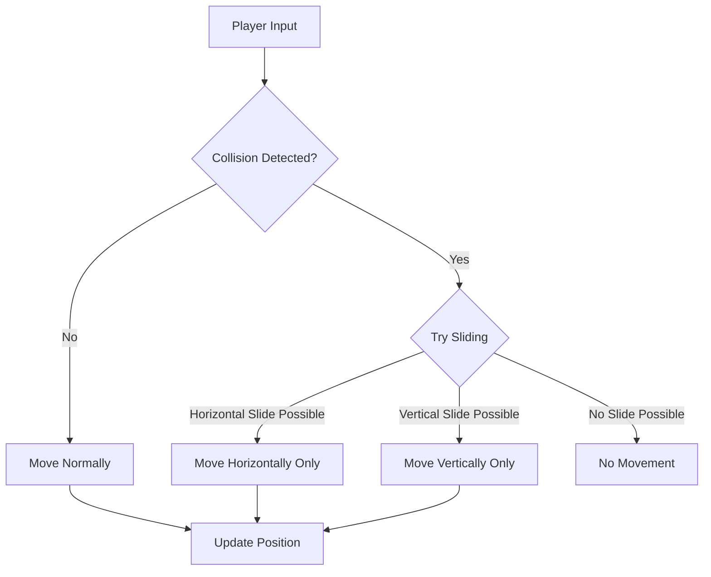
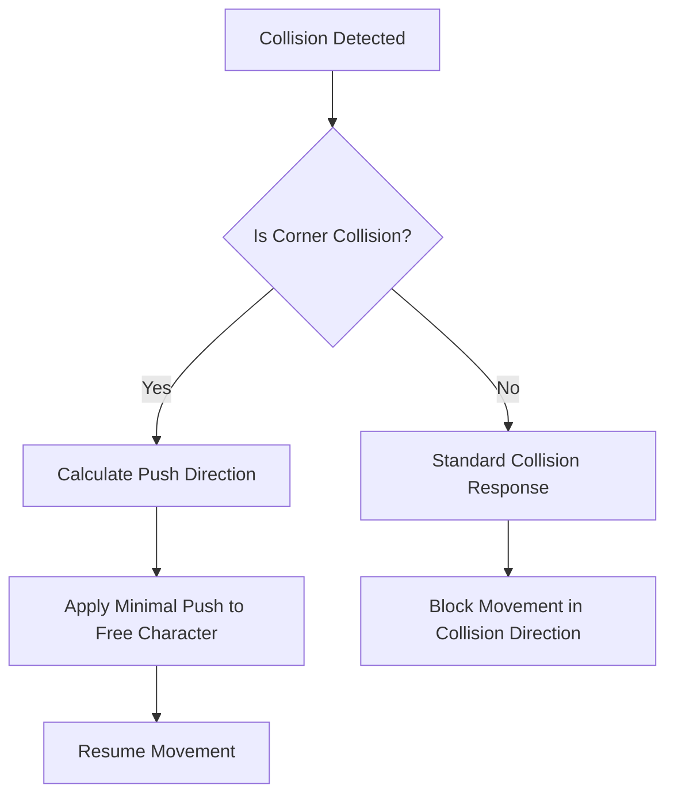

# Collision System Optimization Plan

## Current Issues Identified

1. **Collision Box Mismatch**: Collision boxes don't accurately match the visual sprites, especially for larger objects.
2. **Corner Trapping**: Characters get stuck when colliding with corners of objects.
3. **Inelegant Workaround**: The current solution using `num_colls` counter allows characters to pass through objects if a button is held down long enough.
4. **Item Collision Problems**: Items cause more collision issues than characters or enemies.
5. **Diagonal Movement Issues**: The system doesn't handle diagonal movement well.

## Proposed Solutions

### 1. Implement Sliding Collision Resolution



When a character collides with an object while moving diagonally, instead of stopping completely, we'll try to "slide" along the object by moving in either the horizontal or vertical direction. This is how many commercial games handled collisions and feels more natural to players.

### 2. Improve Collision Box Accuracy

Adjust collision boxes to better match the visual appearance of sprites. For items, we'll implement a more precise collision detection method that takes into account the actual shape of the item rather than just using a rectangular box.

### 3. Implement Corner Detection and Resolution



Detect when a character is colliding with a corner and implement a small "push" to move them slightly away from the corner, preventing them from getting trapped.

### 4. Optimize Collision Detection Performance

Implement spatial partitioning to reduce the number of collision checks needed. Only check for collisions with objects that are near the character, not all objects in the scene.

### 5. Separate Collision Types

Implement different collision handling for different types of objects:
- Solid objects (walls, furniture): Complete blocking with sliding
- Interactive objects (items): Precise collision for interaction
- Characters/Enemies: Softer collision with possible pushing

## Implementation Plan

### Phase 1: Refactor Collision Detection Functions

1. Modify the collision detection functions to return more information about the collision:
   - The object collided with
   - The collision normal (direction)
   - The penetration depth

2. Implement a new collision resolution function that uses this information to determine how to respond.

### Phase 2: Implement Sliding Collision

1. When a collision is detected, try to move the character along the collision surface.
2. For diagonal movement, if a collision is detected, try moving horizontally or vertically instead of stopping completely.

### Phase 3: Improve Corner Handling

1. Detect corner collisions by checking the collision normal and surrounding objects.
2. Implement a small push to free the character from corners.

### Phase 4: Optimize Performance

1. Implement a simple spatial partitioning system to reduce collision checks.
2. Only check collisions with objects that are within a certain distance of the character.

### Phase 5: Testing and Refinement

1. Test the new collision system with various scenarios.
2. Fine-tune parameters for optimal performance and feel.

## Code Structure Changes

Here's how we'll modify the key functions:

1. **detect_char_item_collision**, **detect_char_enemy_collision**, **detect_char_char_collision**:
   - Return collision information instead of just the object index
   - Include collision normal and penetration depth

2. **handle_character_movement**:
   - Implement sliding collision resolution
   - Handle corner cases

3. **New Function: resolve_collision**:
   - Take collision information and determine how to respond
   - Implement sliding along surfaces
   - Handle corner pushing

## Performance Considerations for Sega Genesis Hardware

1. **CPU Optimization (Motorola 68000 @ 7.6MHz)**:
   - Avoid floating-point operations entirely, as the 68000 has no FPU
   - Use fixed-point arithmetic (8.8 or 16.16) for any required calculations
   - Minimize division operations, which are slow on the 68000 (use bit shifts where possible)
   - Precompute values where possible rather than calculating at runtime
   - Use lookup tables for complex calculations (e.g., collision responses)
   - Implement early-exit conditions in collision checks to avoid unnecessary processing

2. **Memory Optimization (64KB Main RAM)**:
   - Keep collision data structures compact (8-bit values where possible)
   - Reuse existing memory buffers rather than creating new ones
   - Avoid dynamic memory allocation during gameplay
   - Use bit flags instead of full bytes for boolean values when possible
   - Consider using a pool of pre-allocated collision objects

3. **Spatial Optimization Techniques**:
   - Implement a simple grid-based spatial partitioning system
   - Only check collisions with objects in the same or adjacent grid cells
   - Skip collision checks for objects beyond a certain distance threshold
   - Process only visible/active objects in the current screen area

4. **Algorithmic Optimizations**:
   - Use Manhattan distance for proximity checks instead of Euclidean distance
   - Implement Axis-Aligned Bounding Box (AABB) collision detection
   - Use separating axis theorem only when necessary for more complex shapes
   - Implement a two-phase collision system: broad phase (quick check) and narrow phase (detailed)
   - Cache collision results for a few frames when appropriate

5. **VDP Considerations**:
   - Synchronize collision processing with VBlank when possible
   - Distribute collision checks across multiple frames for complex scenes
   - Prioritize collision checks based on gameplay importance

6. **Memory Usage**:
   - The new CollisionInfo structure will require approximately 5 bytes per collision
   - Total additional memory usage should be less than 256 bytes
   - We'll reuse existing collision detection code paths where possible

## Technical Implementation Details

### New Collision Information Structure

```c
typedef struct {
    u16 object_id;        // ID of the collided object (or NONE if no collision)
    s8 normal_x;          // X component of collision normal (-1, 0, or 1)
    s8 normal_y;          // Y component of collision normal (-1, 0, or 1)
    u8 penetration;       // How far the objects are overlapping
    u8 collision_type;    // Type of collision (CORNER, EDGE, FACE)
} CollisionInfo;
```

### Modified Collision Detection Functions

The collision detection functions will be updated to fill this structure instead of just returning an object ID.

### Sliding Algorithm

When a collision is detected during diagonal movement:
1. Try moving only horizontally (keeping the original X movement but setting Y movement to 0)
2. If horizontal movement also causes a collision, try moving only vertically
3. If both fail, don't move at all

This creates a natural sliding effect along walls and objects.

### Corner Detection

A corner collision is detected when:
1. The character is colliding with an object
2. The character would also collide with another object if moved slightly in a perpendicular direction

When a corner is detected, apply a small push in the direction away from the corner to prevent the character from getting trapped.

## Implementation Priorities

To ensure we maintain good performance while improving the collision system, we should implement the changes in this order:

1. **First Priority: Basic Sliding Collision**
   - Implement the simplest form of sliding collision that works when a character hits a wall at an angle
   - This provides the biggest improvement in gameplay feel with minimal performance impact
   - Use existing collision detection functions with minimal modifications

2. **Second Priority: Collision Information Structure**
   - Refactor collision detection to return more detailed information
   - Implement the CollisionInfo structure with minimal memory footprint
   - Update collision response to use this new information

3. **Third Priority: Corner Detection**
   - Add basic corner detection for the most common cases
   - Implement a simple push mechanism to prevent character trapping
   - Test with various object configurations to ensure it works reliably

4. **Fourth Priority: Performance Optimizations**
   - Add spatial partitioning only if performance issues are observed
   - Implement early-exit conditions in collision checks
   - Add distance-based filtering to skip unnecessary collision checks

5. **Final Priority: Advanced Features**
   - Implement different collision responses for different object types
   - Add more precise collision shapes if needed
   - Fine-tune parameters based on gameplay testing

This prioritized approach ensures that we get the most important improvements implemented first, with each subsequent phase adding more refinement while maintaining performance.