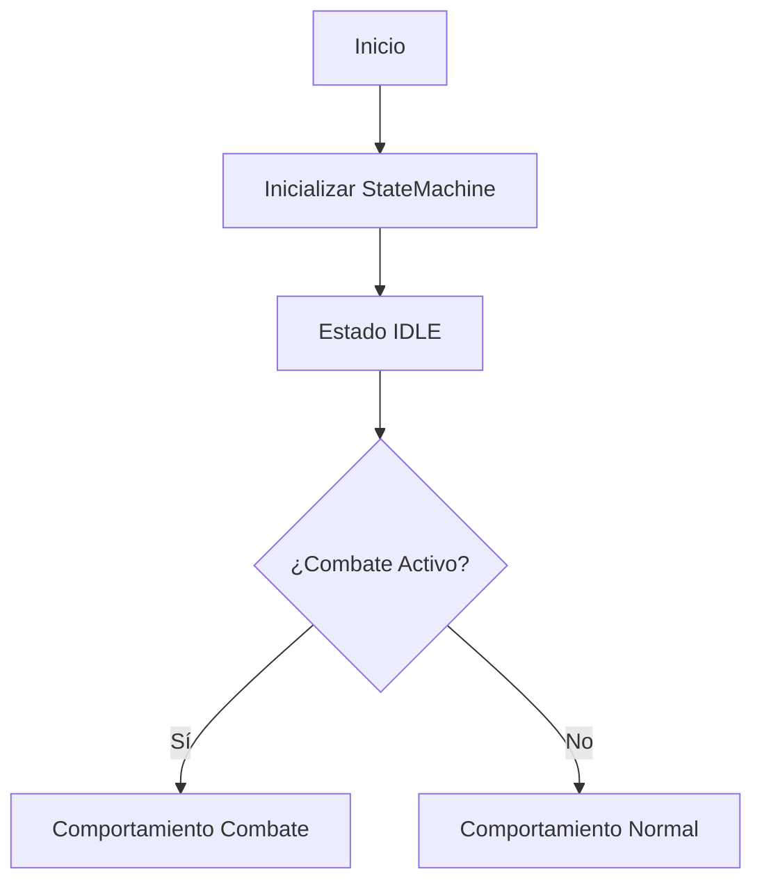

# Descripción de la Máquina de Estados

## Visión General

La máquina de estados es el núcleo del sistema de combate y patrones del juego. Su función principal es gestionar el comportamiento de las entidades (personajes y enemigos) tanto dentro como fuera del combate, manteniendo la coherencia del sistema en todo momento.

## Componentes Principales

### 1. Estados Base
Cada entidad tiene un estado base que define su comportamiento fundamental:
- **IDLE**: Estado de reposo, la entidad está a la espera de acciones
- **WALKING**: La entidad está en movimiento
- **PLAYING_NOTE**: Reproduciendo una nota musical
- **PATTERN_CHECK**: Verificando si un patrón está completo
- **PATTERN_EFFECT**: Ejecutando el efecto de un patrón
- **PATTERN_EFFECT_FINISH**: Finalizando el efecto de un patrón
- **ATTACK_FINISHED**: Periodo de enfriamiento tras un ataque
- **FOLLOWING**: La entidad está siguiendo a otra

### 2. Contexto de Combate
El sistema utiliza un flag `is_combat_active` que modifica el comportamiento de los estados base:
- No crea nuevos estados específicos para combate
- Cada estado se comporta de manera diferente según el contexto
- Permite transiciones suaves entre combate y exploración

### 3. Sistema de Mensajes
La comunicación entre componentes se realiza mediante mensajes:
- **MSG_PATTERN_COMPLETE**: Un patrón se ha completado
- **MSG_COMBAT_START/END**: Inicio/fin del combate
- **MSG_ENEMY_DEFEATED**: Un enemigo ha sido derrotado
- **MSG_PLAYER_HIT**: El jugador ha recibido daño
- **MSG_ENEMY_HIT**: Un enemigo ha recibido daño
- **MSG_NOTE_PLAYED**: Se ha reproducido una nota
- **MSG_PATTERN_TIMEOUT**: Tiempo de espera agotado

## Flujo de Funcionamiento

### 1. Inicialización

### 2. Ciclo de Estados
1. La entidad comienza en IDLE
2. Al recibir una nota:
   - Transición a PLAYING_NOTE
   - Reproduce la nota
   - Almacena la nota en el buffer
3. Al completar la nota:
   - Transición a PATTERN_CHECK
   - Verifica si forma un patrón válido
4. Si hay patrón válido:
   - Transición a PATTERN_EFFECT
   - Ejecuta el efecto (diferente según contexto)
5. Al completar efecto:
   - Transición a PATTERN_EFFECT_FINISH
   - Limpieza y vuelta a IDLE

### 3. Gestión del Tiempo
Cada estado tiene tiempos máximos definidos:
- MAX_NOTE_PLAYING_TIME: Duración máxima de una nota
- MAX_PATTERN_WAIT_TIME: Tiempo máximo entre notas
- MAX_EFFECT_TIME: Duración máxima de efectos
- MAX_TIME_AFTER_ATTACK: Tiempo de enfriamiento post-ataque

## Comportamientos Específicos

### En Estado IDLE
- **Contexto Normal**:
  - Animación de reposo
  - Responde a interacciones del entorno
  - Puede iniciar movimiento

- **Contexto Combate**:
  - Monitorea amenazas
  - Prepara defensas
  - Evalúa oportunidades de ataque

### En Estado PLAYING_NOTE
- **Contexto Normal**:
  - Efectos visuales estándar
  - Interacción con puzzles
  - Modificaciones del entorno

- **Contexto Combate**:
  - Cálculo de daño
  - Efectos de estado
  - Animaciones de ataque

## Sistema de Pruebas

Para garantizar el correcto funcionamiento, cada aspecto debe ser verificable:

1. **Transiciones de Estado**
   - Verificar todas las transiciones posibles
   - Comprobar tiempos máximos
   - Validar condiciones de cambio

2. **Gestión de Mensajes**
   - Probar cada tipo de mensaje
   - Verificar respuestas correctas
   - Comprobar manejo de errores

3. **Contexto de Combate**
   - Validar cambios de comportamiento
   - Probar inicio/fin de combate
   - Verificar efectos específicos

4. **Patrones y Efectos**
   - Comprobar reconocimiento de patrones
   - Validar efectos en cada contexto
   - Verificar tiempos y animaciones

## Consideraciones de Implementación

1. **Estabilidad**
   - Cada estado debe ser estable por sí mismo
   - Las transiciones deben ser robustas
   - El sistema debe manejar casos extremos

2. **Rendimiento**
   - Minimizar comprobaciones redundantes
   - Optimizar cambios de estado
   - Gestionar eficientemente los timers

3. **Extensibilidad**
   - Facilitar adición de nuevos estados
   - Permitir nuevos tipos de mensajes
   - Mantener código modular

## Próximos Pasos

1. Implementar biblioteca de pruebas
2. Verificar funcionamiento actual
3. Integrar contexto de combate
4. Expandir efectos y patrones