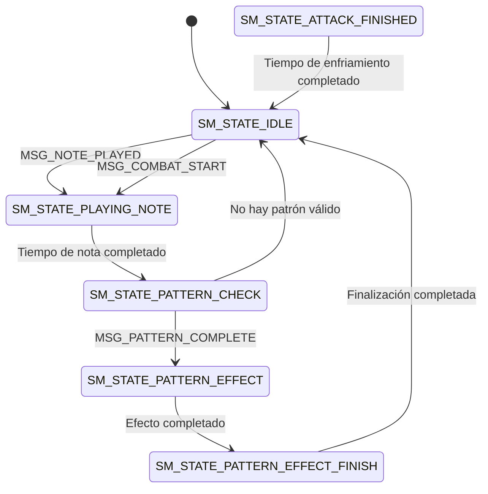

# Plan de Implementación de la Máquina de Estados

## Análisis de la Situación Actual

Actualmente tenemos:

- Una implementación básica de máquina de estados en `statemachine.c/h`
- Estados definidos: `SM_STATE_IDLE`, `SM_STATE_CASTING`, `SM_STATE_EFFECT`, `SM_STATE_EFFECT_FINISH`
- Mensajes definidos: `MSG_PATTERN_COMPLETE`, `MSG_COMBAT_START`, `MSG_ENEMY_DEFEATED`
- Una estructura `StateMachine` con campos básicos: `current_state`, `timer`, `notes[4]`, `note_count`

Sin embargo, según la documentación en `activeContext.md`, necesitamos una implementación más completa que pueda manejar todos los aspectos del sistema de combate y patrones.

## Plan para Expandir statemachine.c/h

### Paso 1: Actualizar el Enum SM_State

Modificaremos el enum `SM_State` para incluir todos los estados necesarios según la documentación:

```c
typedef enum {
    SM_STATE_IDLE,               // Sistema inactivo
    SM_STATE_PLAYING_NOTE,       // Reproduciendo una nota
    SM_STATE_PATTERN_CHECK,      // Verificando si el patrón es válido
    SM_STATE_PATTERN_EFFECT,     // Ejecutando el efecto del patrón
    SM_STATE_PATTERN_EFFECT_FINISH, // Finalizando el efecto del patrón
    SM_STATE_ATTACK_FINISHED     // Ataque finalizado, en enfriamiento
} SM_State;
```

### Paso 2: Expandir el Enum MessageType

Añadiremos más tipos de mensajes para cubrir todas las interacciones necesarias:

```c
typedef enum {
    MSG_PATTERN_COMPLETE,        // Patrón completado
    MSG_COMBAT_START,            // Inicio de combate
    MSG_COMBAT_END,              // Fin de combate
    MSG_ENEMY_DEFEATED,          // Enemigo derrotado
    MSG_PLAYER_HIT,              // Jugador golpeado
    MSG_ENEMY_HIT,               // Enemigo golpeado
    MSG_NOTE_PLAYED,             // Nota reproducida
    MSG_PATTERN_TIMEOUT          // Tiempo de espera del patrón agotado
} MessageType;
```

### Paso 3: Expandir la Estructura StateMachine

Ampliaremos la estructura `StateMachine` para incluir todos los campos necesarios:

```c
typedef struct {
    SM_State current_state;      // Estado actual
    u16 timer;                   // Temporizador general
    u8 notes[4];                 // Notas del patrón actual
    u8 note_count;               // Número de notas reproducidas
    u8 current_note;             // Nota actual que se está reproduciendo
    u16 note_time;               // Tiempo que lleva reproduciendo la nota
    u16 pattern_time;            // Tiempo desde la última nota
    u16 active_pattern;          // Patrón activo (si hay alguno)
    bool is_reversed;            // Si el patrón es invertido
    u16 effect_time;             // Tiempo que lleva el efecto activo
    u16 entity_id;               // ID de la entidad (jugador o enemigo)
} StateMachine;
```

### Paso 4: Actualizar la Función StateMachine_Init

Modificaremos la función de inicialización para configurar todos los nuevos campos:

```c
void StateMachine_Init(StateMachine *sm, u16 entity_id) {
    sm->current_state = SM_STATE_IDLE;
    sm->timer = 0;
    sm->note_count = 0;
    sm->current_note = 0;
    sm->note_time = 0;
    sm->pattern_time = 0;
    sm->active_pattern = 0;
    sm->is_reversed = false;
    sm->effect_time = 0;
    sm->entity_id = entity_id;
    
    // Inicializar array de notas
    for (u8 i = 0; i < 4; i++) {
        sm->notes[i] = 0;
    }
}
```

### Paso 5: Expandir la Función StateMachine_Update

Ampliaremos la función `StateMachine_Update` para manejar todos los estados y mensajes:

```c
void StateMachine_Update(StateMachine *sm, Message *msg) {
    // Lógica de actualización para cada estado
    switch (sm->current_state) {
        case SM_STATE_IDLE:
            // Manejar mensajes en estado IDLE
            if (msg != NULL) {
                switch (msg->type) {
                    case MSG_COMBAT_START:
                        sm->current_state = SM_STATE_PLAYING_NOTE;
                        sm->timer = 0;
                        break;
                    case MSG_NOTE_PLAYED:
                        sm->current_state = SM_STATE_PLAYING_NOTE;
                        sm->current_note = msg->param;
                        sm->notes[sm->note_count++] = msg->param;
                        sm->note_time = 0;
                        break;
                    default:
                        break;
                }
            }
            break;
            
        case SM_STATE_PLAYING_NOTE:
            // Lógica para reproducir notas
            sm->note_time++;
            if (sm->note_time > MAX_NOTE_PLAYING_TIME) {
                sm->current_state = SM_STATE_PATTERN_CHECK;
                sm->note_time = 0;
            }
            break;
            
        case SM_STATE_PATTERN_CHECK:
            // Aquí iría la lógica para verificar patrones
            // Por ahora, simplemente transicionamos a IDLE o EFFECT
            if (msg != NULL && msg->type == MSG_PATTERN_COMPLETE) {
                sm->current_state = SM_STATE_PATTERN_EFFECT;
                sm->active_pattern = msg->param;
                sm->effect_time = 0;
            } else {
                sm->current_state = SM_STATE_IDLE;
            }
            break;
            
        case SM_STATE_PATTERN_EFFECT:
            // Lógica para efectos de patrones
            sm->effect_time++;
            if (sm->effect_time > MAX_EFFECT_TIME) {
                sm->current_state = SM_STATE_PATTERN_EFFECT_FINISH;
                sm->effect_time = 0;
            }
            break;
            
        case SM_STATE_PATTERN_EFFECT_FINISH:
            // Lógica para finalizar efectos
            sm->timer++;
            if (sm->timer > 20) {
                sm->current_state = SM_STATE_IDLE;
                sm->timer = 0;
                sm->active_pattern = 0;
            }
            break;
            
        case SM_STATE_ATTACK_FINISHED:
            // Lógica para el estado post-ataque
            sm->timer++;
            if (sm->timer > MAX_TIME_AFTER_ATTACK) {
                sm->current_state = SM_STATE_IDLE;
                sm->timer = 0;
            }
            break;
            
        default:
            // Manejar estado desconocido
            sm->current_state = SM_STATE_IDLE;
            sm->timer = 0;
            break;
    }
}
```

### Paso 6: Añadir Función para Enviar Mensajes

Crearemos una nueva función para enviar mensajes:

```c
void StateMachine_SendMessage(StateMachine *sm, MessageType type, u16 param) {
    Message msg;
    msg.type = type;
    msg.param = param;
    StateMachine_Update(sm, &msg);
}
```

## Diagrama de la Máquina de Estados



## Consideraciones Adicionales

1. **Constantes**: Necesitaremos definir constantes como `MAX_NOTE_PLAYING_TIME`, `MAX_EFFECT_TIME`, y `MAX_TIME_AFTER_ATTACK`.

2. **Compatibilidad**: Esta implementación expandida mantendrá compatibilidad con el código existente mientras proporciona la base para la integración futura.

3. **Pruebas**: Aunque no integraremos la máquina de estados con otros sistemas en este paso, debemos asegurarnos de que la implementación expandida compile correctamente.

## Próximos Pasos

Una vez que hayamos expandido statemachine.c/h, los siguientes pasos serían:

1. Integrar la máquina de estados con el sistema de patrones del personaje
2. Integrar la máquina de estados con el sistema de patrones de enemigos
3. Crear una función combat_update en combat.c que utilice la máquina de estados
4. Realizar pruebas exhaustivas para asegurar que todo funciona correctamente