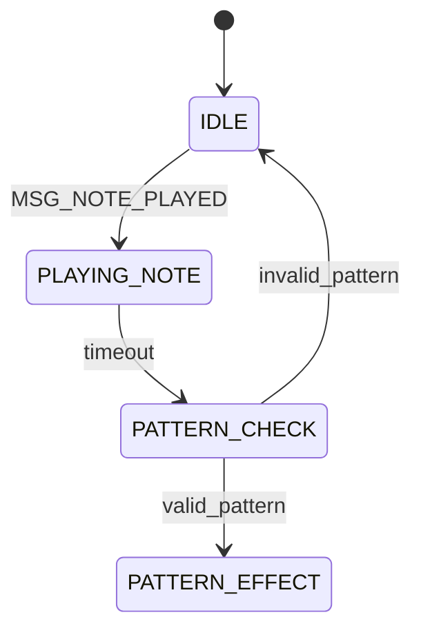

# Plan de Implementación Unificado: State Machine y Testing

## Visión General

Este plan unifica la implementación de la máquina de estados con su framework de pruebas, asegurando que cada componente sea verificable y mantenga la calidad del código.

## Fase 1: Framework de Pruebas Base

### Estado Actual ✓
- Framework de pruebas integrado con SGDK
- Sistema de logging mediante KLog
- Estructura de test unificada
- Macros de aserción implementados

### Pendiente
- Resolver errores de include path
- Verificar compilación completa
- Validar integración SGDK

## Fase 2: Implementación State Machine

### Paso 1: Estados Base
```c
typedef enum {
    SM_STATE_IDLE,
    SM_STATE_PLAYING_NOTE,
    SM_STATE_PATTERN_CHECK,
    SM_STATE_PATTERN_EFFECT,
    SM_STATE_PATTERN_EFFECT_FINISH,
    SM_STATE_ATTACK_FINISHED
} SM_State;
```

Tests correspondientes:
```c
TestResult test_state_machine_init();
TestResult test_state_transitions();
```

### Paso 2: Sistema de Mensajes
```c
typedef enum {
    MSG_PATTERN_COMPLETE,
    MSG_COMBAT_START,
    MSG_COMBAT_END,
    // ...
} MessageType;
```

Tests correspondientes:
```c
TestResult test_message_handling();
TestResult test_combat_messages();
```

### Paso 3: Estructura Principal
```c
typedef struct {
    SM_State current_state;
    u16 timer;
    u8 notes[4];
    // ...
} StateMachine;
```

Tests correspondientes:
```c
TestResult test_state_data();
TestResult test_timing_behavior();
```

## Fase 3: Integración con Sistemas Existentes

### 1. Sistema de Patrones
- Integrar con character_patterns.c
- Integrar con enemies_patterns.c
- Añadir pruebas específicas de patrones

### 2. Sistema de Combate
- Integrar con combat.c
- Implementar combat_update()
- Añadir pruebas de combate

### 3. Interfaz de Usuario
- Actualizar UI según estados
- Verificar feedback visual
- Probar transiciones UI

## Plan de Pruebas Detallado

### 1. Pruebas Unitarias
```c
// Estado y transiciones
test_state_machine_init()
test_state_transitions()
test_message_handling()

// Comportamiento temporal
test_timing_behavior()
test_pattern_timing()
test_effect_duration()

// Integración
test_pattern_recognition()
test_combat_flow()
test_ui_feedback()
```

### 2. Casos de Prueba Específicos

#### Transiciones de Estado


Pruebas necesarias:
1. Transición válida IDLE -> PLAYING_NOTE
2. Timeout en PLAYING_NOTE
3. Validación de patrón
4. Cancelación de patrón

#### Manejo de Mensajes
1. Envío de mensaje válido
2. Mensaje en estado incorrecto
3. Mensaje con parámetros inválidos
4. Secuencia de mensajes

#### Timing y Efectos
1. Duración correcta de notas
2. Tiempo de efecto de patrón
3. Tiempo de enfriamiento
4. Timeouts y cancelaciones

## Verificación y Validación

### 1. Criterios de Éxito
- Todos los tests pasan
- No hay memory leaks
- Performance aceptable
- UI responsive

### 2. Métricas
- Cobertura de código
- Tiempo de ejecución
- Uso de memoria
- Tasa de éxito de tests

### 3. Documentación
- Actualizar descripción de estados
- Documentar casos de prueba
- Mantener diagramas actualizados

## Plan de Implementación

### Fase 1: Setup (Actual)
- [x] Framework de pruebas base
- [x] Integración SGDK
- [ ] Resolver includes

### Fase 2: Core (Siguiente)
- [ ] Implementar estados base
- [ ] Sistema de mensajes
- [ ] Estructura principal
- [ ] Tests unitarios básicos

### Fase 3: Integración
- [ ] Sistema de patrones
- [ ] Sistema de combate
- [ ] UI y feedback
- [ ] Tests de integración

### Fase 4: Refinamiento
- [ ] Optimización
- [ ] Edge cases
- [ ] Documentación
- [ ] Tests de stress

## Consideraciones

### 1. Técnicas
- Mantener compatibilidad SGDK
- Optimizar uso de memoria
- Considerar timing preciso

### 2. Arquitectura
- Separación clara de responsabilidades
- Interfaces bien definidas
- Extensibilidad futura

### 3. Testing
- Tests independientes
- Cobertura completa
- Fácil mantenimiento

## Próximos Pasos Inmediatos

1. Resolver errores de include path
2. Verificar framework de pruebas
3. Implementar estados base
4. Ejecutar primera suite de tests

## Notas de Implementación

### 1. Prioridades
- Estabilidad sobre features
- Testing exhaustivo
- Documentación clara

### 2. Riesgos
- Timing crítico
- Integración compleja
- Edge cases inesperados

### 3. Mitigación
- Tests específicos
- Logging detallado
- Revisión continua