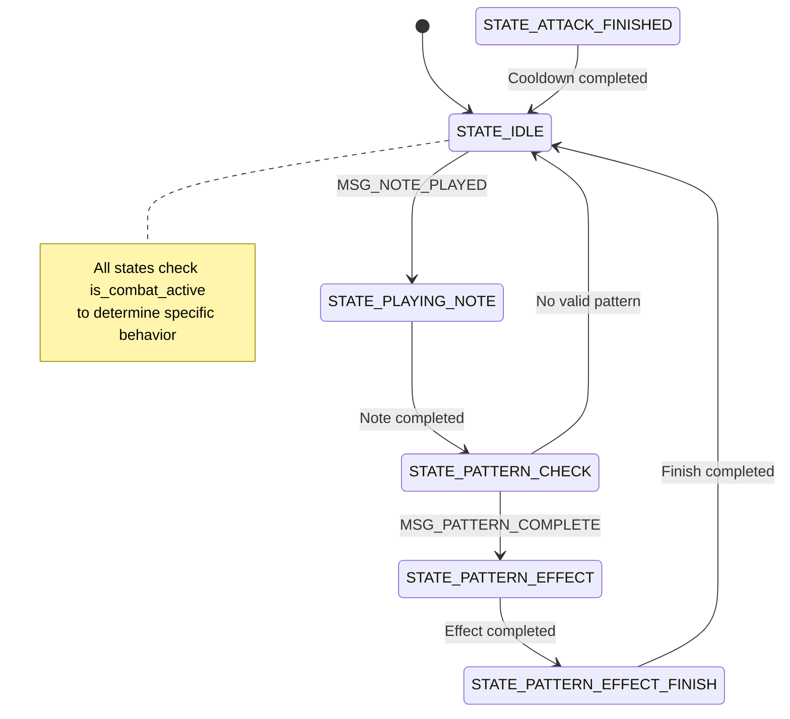

# Unified State Machine Implementation Plan

## Current System Analysis

### Entity States (entity.h)
Currently implemented:
```c
typedef enum {
    STATE_IDLE,
    STATE_WALKING,
    STATE_PLAYING_NOTE,
    STATE_PATTERN_CHECK,
    STATE_PATTERN_EFFECT,
    STATE_PATTERN_EFFECT_FINISH,
    STATE_ATTACK_FINISHED,
    STATE_FOLLOWING
} GameState;
```

### State Machine (statemachine.c/h)
Currently implements:
- Basic state management with SM_State enum
- Message-based transitions
- Timer-based progression
- Pattern and note tracking

### Combat System (combat.c)
Handles:
- Combat initialization/cleanup
- Damage calculation
- UI management
- Uses is_combat_active flag

## Implementation Strategy

Key insight: Instead of creating new combat states, we'll make existing states context-aware through the is_combat_active flag.

### Implementation Steps

#### Step 1: Update statemachine.h
```c
#ifndef STATEMACHINE_H
#define STATEMACHINE_H

// Time constants
#define MAX_NOTE_PLAYING_TIME  500  // Max note playing time in ms
#define MAX_PATTERN_WAIT_TIME 2000  // Max wait time for next note in ms
#define MAX_EFFECT_TIME       1600  // Max pattern effect time in ms
#define MAX_TIME_AFTER_ATTACK 1000  // Max post-attack time in ms

// Message types for component communication
typedef enum {
    MSG_PATTERN_COMPLETE,        // Pattern completed
    MSG_COMBAT_START,            // Combat initiated
    MSG_COMBAT_END,             // Combat ended
    MSG_ENEMY_DEFEATED,         // Enemy defeated
    MSG_PLAYER_HIT,            // Player took damage
    MSG_ENEMY_HIT,             // Enemy took damage
    MSG_NOTE_PLAYED,           // Note played
    MSG_PATTERN_TIMEOUT        // Pattern timed out
} MessageType;

// Message structure
typedef struct {
    MessageType type;            // Message type
    u16 param;                   // Additional parameter
} Message;

// State machine structure
typedef struct {
    SM_State current_state;      // Current state
    u16 timer;                   // General timer
    u8 notes[4];                // Current pattern notes
    u8 note_count;              // Number of notes played
    u8 current_note;            // Currently playing note
    u16 note_time;              // Time spent playing note
    u16 pattern_time;           // Time since last note
    u16 active_pattern;         // Active pattern (if any)
    bool is_reversed;           // If pattern is reversed
    u16 effect_time;            // Effect duration
    u16 entity_id;              // Entity ID
} StateMachine;

// Core functions
void StateMachine_Init(StateMachine *sm, u16 entity_id);
void StateMachine_Update(StateMachine *sm, Message *msg);
void StateMachine_SendMessage(StateMachine *sm, MessageType type, u16 param);

#endif
```

Verification:
1. Compile to ensure no syntax errors
2. Check all constants match existing timing values
3. Verify all required message types are included

#### Step 2: Update statemachine.c Core Functions
```c
void StateMachine_Init(StateMachine *sm, u16 entity_id) {
    sm->current_state = SM_STATE_IDLE;
    sm->timer = 0;
    sm->note_count = 0;
    sm->current_note = 0;
    sm->note_time = 0;
    sm->pattern_time = 0;
    sm->active_pattern = 0;
    sm->is_reversed = false;
    sm->effect_time = 0;
    sm->entity_id = entity_id;
    
    for (u8 i = 0; i < 4; i++) {
        sm->notes[i] = 0;
    }
}

void StateMachine_SendMessage(StateMachine *sm, MessageType type, u16 param) {
    Message msg;
    msg.type = type;
    msg.param = param;
    StateMachine_Update(sm, &msg);
}
```

Verification:
1. Compile to check syntax
2. Verify initialization sets all fields
3. Test message sending works correctly

#### Step 3: Implement Context-Aware State Update
```c
void StateMachine_Update(StateMachine *sm, Message *msg) {
    switch (sm->current_state) {
        case SM_STATE_IDLE:
            if (msg != NULL) {
                switch (msg->type) {
                    case MSG_COMBAT_START:
                    case MSG_NOTE_PLAYED:
                        sm->current_state = SM_STATE_PLAYING_NOTE;
                        sm->current_note = msg->param;
                        sm->notes[sm->note_count++] = msg->param;
                        sm->note_time = 0;
                        break;
                }
            }
            break;
            
        case SM_STATE_PLAYING_NOTE:
            sm->note_time++;
            if (sm->note_time > MAX_NOTE_PLAYING_TIME) {
                sm->current_state = SM_STATE_PATTERN_CHECK;
                sm->note_time = 0;
            }
            break;
            
        case SM_STATE_PATTERN_CHECK:
            if (msg != NULL && msg->type == MSG_PATTERN_COMPLETE) {
                sm->current_state = SM_STATE_PATTERN_EFFECT;
                sm->active_pattern = msg->param;
                sm->effect_time = 0;
            } else {
                sm->current_state = SM_STATE_IDLE;
            }
            break;
            
        case SM_STATE_PATTERN_EFFECT:
            sm->effect_time++;
            if (sm->effect_time > MAX_EFFECT_TIME) {
                sm->current_state = SM_STATE_PATTERN_EFFECT_FINISH;
                sm->effect_time = 0;
            }
            break;
            
        case SM_STATE_PATTERN_EFFECT_FINISH:
            sm->timer++;
            if (sm->timer > 20) {
                sm->current_state = SM_STATE_IDLE;
                sm->timer = 0;
                sm->active_pattern = 0;
            }
            break;
            
        case SM_STATE_ATTACK_FINISHED:
            sm->timer++;
            if (sm->timer > MAX_TIME_AFTER_ATTACK) {
                sm->current_state = SM_STATE_IDLE;
                sm->timer = 0;
            }
            break;
            
        default:
            sm->current_state = SM_STATE_IDLE;
            sm->timer = 0;
            break;
    }
}
```

Verification:
1. Compile and test basic state transitions
2. Verify timer-based transitions work
3. Test message handling in each state

#### Step 4: Update Entity Behavior System
```c
void update_entity_behavior(Entity* entity) {
    switch(entity->state) {
        case STATE_IDLE:
            if (is_combat_active) {
                // Combat-specific idle behavior
                update_combat_idle(entity);
            } else {
                // Normal idle behavior
                update_normal_idle(entity);
            }
            break;
            
        case STATE_PLAYING_NOTE:
            if (is_combat_active) {
                // Combat pattern mechanics
                update_combat_note(entity);
            } else {
                // Normal pattern effects
                update_normal_note(entity);
            }
            break;
            
        // Additional states...
    }
}
```

Verification:
1. Test behavior differences in combat/non-combat
2. Verify smooth transitions between contexts
3. Check all animations work correctly

#### Step 5: Enhance Combat Integration
```c
void start_combat(bool start) {
    if (start) {
        is_combat_active = true;
        player_scroll_active = false;
        
        // Initialize enemies
        for (u8 numenemy = 0; numenemy < MAX_ENEMIES; numenemy++) {
            if (obj_enemy[numenemy].obj_character.active) {
                // Reset HP and randomize cooldowns
                initialize_enemy_combat(numenemy);
            }
        }
        
        // Setup UI
        setup_combat_interface();
    } else {
        is_combat_active = false;
        player_scroll_active = true;
        cleanup_combat_interface();
    }
}
```

Verification:
1. Test combat initialization/cleanup
2. Verify UI elements appear/disappear correctly
3. Check enemy state management

## State Machine Diagram



## Testing Strategy

For each implementation step:
1. Compile and fix any syntax errors
2. Test basic functionality
3. Verify state transitions
4. Check combat/non-combat behavior differences
5. Test edge cases
6. Verify no regressions in existing functionality

## Next Steps

After completing these implementation steps:
1. Add more sophisticated combat behaviors
2. Enhance pattern effects for combat
3. Implement status effects system
4. Add advanced enemy AI behaviors

## Notes

- Each step maintains complete functionality
- Steps can be tested independently
- Combat context modifies behavior without changing state flow
- Existing code structure is preserved
- Performance impact is minimal